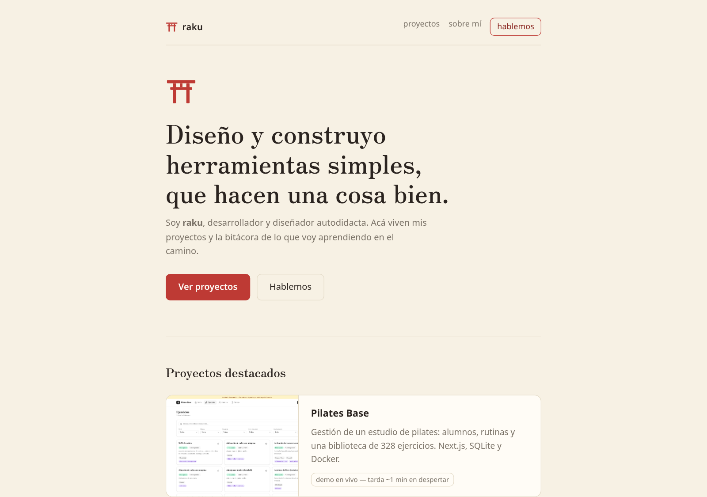
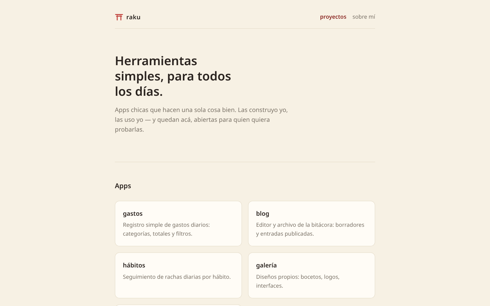

# rakudotcom

Sitio personal de raku: bitácora, portfolio y un hub de herramientas simples.
Hecho a mano con los fundamentos de la web: HTML, CSS y JavaScript.
Vanilla a propósito — un sitio personal no necesita más: clonás, abrís `index.html` y funciona.

## Qué hay acá

- **Bitácora** (`/`) — notas publicadas en cascada, la más nueva arriba. El contenido es parte del repo: `blog/datos/entradas-publicadas.js`.
- **Proyectos** (`proyectos/`) — la vidriera de apps.
- **Sobre mí** (`sobre-mi/`) — bio y contacto.
- **Apps** — [gastos](gastos/), [blog](blog/) (el taller de la bitácora), [hábitos](habitos/) y [galería](galeria/). Cada una resuelve una sola cosa; los datos de quien las usa quedan en su propio navegador (localStorage).

## Correr local

Sin dependencias: clonar y abrir `index.html` en el navegador. Todo funciona via `file://`.

## Publicar una entrada en la bitácora

1. Escribir un borrador en el editor del blog (queda en localStorage, con insignia "borrador").
2. Tocar **Exportar para publicar**: se descarga `entradas-publicadas.js` con todo el contenido.
3. Correr `./publicar.sh "bitacora: mi nota"` — mueve el export al repo, commitea y pushea (o hacerlo a mano: reemplazar `blog/datos/entradas-publicadas.js` y commitear). Al recargar el blog, el borrador local se limpia solo.

## Estructura y convenciones

Cada app vive en su carpeta: `index.html` + `css/` (variables, layout, componentes) + `js/` (constantes, storage, lógica, ui, main — una responsabilidad por archivo). `variables.css` es idéntico en todas: la paleta cream + torii es lo que da identidad al hub.
