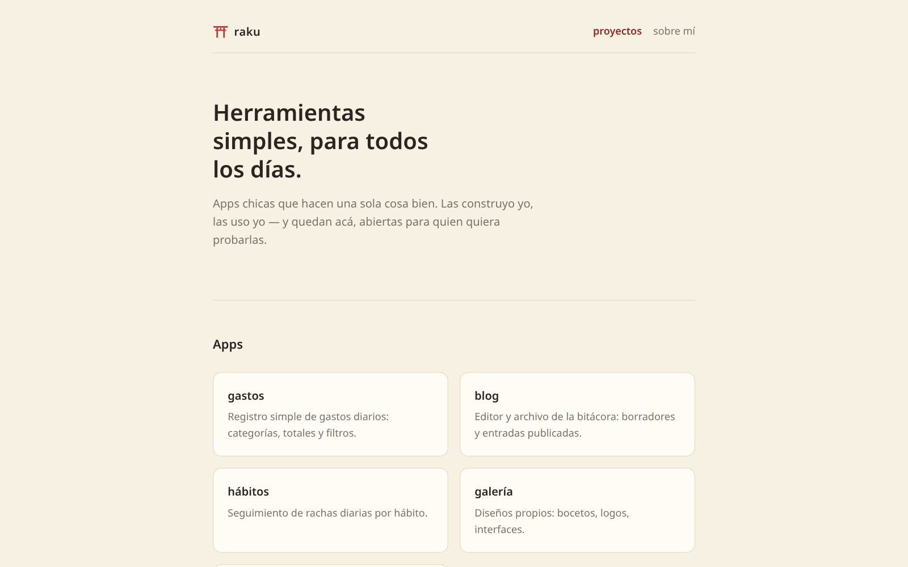

# rakudotcom

Sitio personal de raku: bitácora, portfolio y un hub de herramientas simples.

El shell del sitio (nav, pie, `<head>`) está armado con **Astro** en modo
estático — compila a HTML/CSS/JS planos, no hay servidor ni framework de UI.
Cada app (blog, gastos, hábitos, galería, waveforge, ocaso...) sigue siendo
HTML/CSS/JS escrito a mano, vanilla, tal como siempre: vive en `public/` y
Astro no la toca.


## Qué hay acá

- **Bitácora** (`/`) — notas publicadas en cascada, la más nueva arriba. El contenido es parte del repo: `public/blog/datos/entradas-publicadas.js`.
- **Proyectos** (`/proyectos/`) — la vidriera de apps.
- **Sobre mí** (`/sobre-mi/`) — bio y contacto.
- **Apps** — cada una vive en `/<nombre>/` en el sitio: su landing es una página Astro (`src/pages/<nombre>/`) y su código a mano está en `public/<nombre>/`. Están [gastos](public/gastos/) (rakucash: billetera personal con deudas, análisis y multi-billetera — también instalable como APK Android), [blog](public/blog/) (el taller de la bitácora), [hábitos](public/habitos/), [galería](public/galeria/), [waveforge](public/waveforge/) (motor GPU de visuales audio-reactivos en Python) y [ocaso](public/ocaso/) (un torii y un ocaso animados, algoritmos porteados de waveforge). Cada una resuelve una sola cosa; los datos de quien las usa quedan en su propio navegador (localStorage).



## Correr local

```
npm install
npm run dev       # servidor local con recarga en caliente
npm run build     # genera el sitio estático en dist/
npm run preview   # sirve dist/ para revisar el build antes de publicar
npm test          # compila y corre verificar.mjs
```

Ya **no** funciona abrir `index.html` directo con `file://`: el shell (nav,
pie, `<head>`) lo arma Astro en tiempo de build, así que hace falta correr
`npm run dev` (o servir `dist/` después de `npm run build`) para verlo
completo. Excepción de siempre: `public/gastos/` (rakucash) es un build de
Vite/TypeScript aparte — sus módulos ES tampoco corren por `file://`, se
sirven igual sea con `npm run dev`/`preview` o con cualquier estático propio.

`verificar.mjs` es el chequeo del sitio compilado: sin dependencias ni
navegador, revisa que las 11 páginas se hayan generado, que no quede ningún
`href`/`src` relativo ni apuntando a un archivo que no existe, que la home
cargue sus cuatro scripts en orden, y que la tinta de la paleta pase 4.5:1
contra el fondo. El deploy lo corre entre el build y la publicación, así que
un link roto frena el push en vez de llegar al sitio.

## Publicar una entrada en la bitácora

1. Escribir un borrador en el editor del blog (queda en localStorage, con insignia "borrador").
2. Tocar **Exportar para publicar**: se descarga `entradas-publicadas.js` con todo el contenido.
3. Correr `./publicar.sh "bitacora: mi nota"` — mueve el export al repo, commitea y pushea (o hacerlo a mano: reemplazar `public/blog/datos/entradas-publicadas.js` y commitear). Al recargar el blog, el borrador local se limpia solo.

## Deploy

Cada push a `main` dispara `.github/workflows/deploy.yml`: instala
dependencias, corre `npm run build` y publica `dist/` en GitHub Pages con el
Action oficial (`upload-pages-artifact` + `deploy-pages`). Ya no es Pages
sirviendo la rama directo — hay un paso de build en el medio.

## Estructura y convenciones

- `src/` — el shell de Astro: `layouts/Base.astro` (head + nav + pie
  compartidos), `components/` (`Nav`, `Footer`, `Atmosfera`) y `pages/` (una
  página Astro por sección del hub, que renderiza contra `Base.astro`).
- `public/` — todo lo demás, servido tal cual: cada app con su
  `index.html`/`css`/`js` a mano, más los assets del sitio (`favicon.svg`,
  `capturas/`). `public/css/variables.css` es el sistema de diseño completo
  (paleta cream + torii + índigo, tipografía, espaciado) y vive en un solo
  lugar — antes estaba copiado idéntico en cada carpeta de app, ahora todas
  linkean `/css/variables.css` con ruta absoluta. `public/css/base.css` trae
  el reset, la tipografía global y el nav/pie del hub.
- Excepción: `public/gastos/` es el build estático de un proyecto Vite/TypeScript aparte (`apprakucash`) — mismas capas, pero bundleadas en `assets/`.
